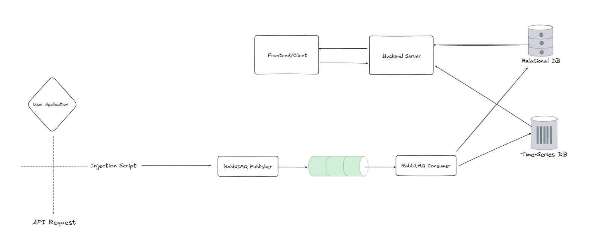

# Project – API Track

A comprehensive platform designed for developers to monitor, analyze, and understand their API usage across web applications. API Track provides real‑time insights, detailed usage statistics, and a scalable architecture built for modern applications.

---

## 🚀 Overview

API Track helps development teams understand how their APIs perform in production and staging environments. With seamless instrumentation, background processing, and time‑series storage, the platform provides:

* Real‑time request tracking
* Historical API usage analytics
* Scalable message‑driven ingestion
* A modern, intuitive dashboard

---

## 🧩 System Architecture

Below is a high‑level architecture diagram illustrating the full workflow, from client‑side interaction to data ingestion and storage.

---

## 🛠️ Tech Stack

### **Frontend (Client)**

* **React** (modern UI library)
* **JavaScript**
* **TailwindCSS** (utility-first styling)
* **Shadcn/UI** (component library)
* **Zustand** (state management)
* **React Router** (routing)

### **Backend (Server)**

* **Node.js**
* **Express**

### **Data Ingestion & Processing**

* **Injection Script**: Node.js (running on Cloudflare)
* **Message Broker**: RabbitMQ
* **Message Publisher/Consumer**: Node.js services

### **Databases**

* **Main Database**: PostgreSQL (via NeonDB)
* **Time-Series Database**: QuestDB (hosted on VPS)

---

## 📞 Contact

Feel free to reach out for collaboration, contributions, or questions!

* **Email:** [your-email@example.com](mailto:your-email@example.com)
* **LinkedIn:** [https://linkedin.com/in/your‑profile](https://linkedin.com/in/your‑profile)
* **GitHub:** [https://github.com/your‑profile](https://github.com/your‑profile)

